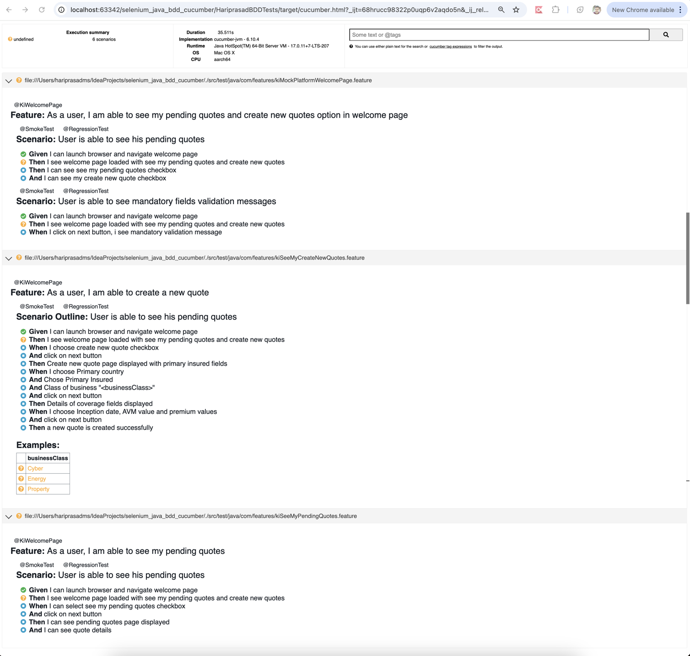

# A comprehensive Selenium Cucumber BDD framework designed using Java.

Technologies used -

Automation library: Selenium web driver library
Programming : Java 
Framework : Cucumber with Page Object Model
Build Tool : Maven

Github repo - https://github.com/hariprasadms/selenium_java_bdd_cucumber.git

Test run results - 

Once checked-out the project. Run below command from project root location.

mvn clean test -Dcucumber.options="./src/test/resources/feature --tags @SmokeTest"

Note : Project is compiled and running on Java 11. It's been tested.

Thanks!

 
